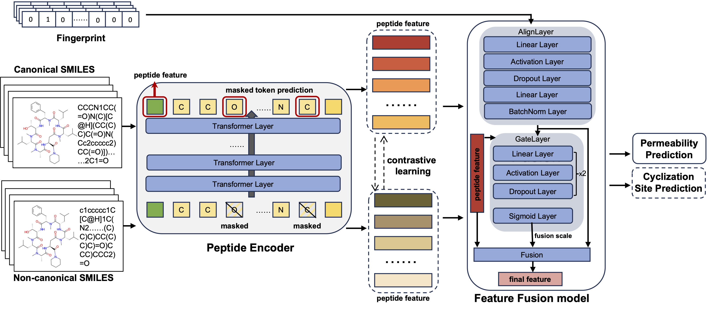

# CyclePermea: Membrane Permeability Prediction of Cyclic Peptides with a Multi-Loss Fusion Network

## Introduction
CyclePermea: Membrane Permeability Prediction of Cyclic Peptides with a Multi-Loss Fusion Network


## Quickly start
### Main requirments
- Python 3.7
- rdkit 2020.09.1.0
- torch 1.11.0
- numpy
- pandas

### Config
You can use yaml files (./DL/config) to control the parameters as well as the network structure.

### Train
```python
python main.py
```

### Test
```python
python test.py
```


