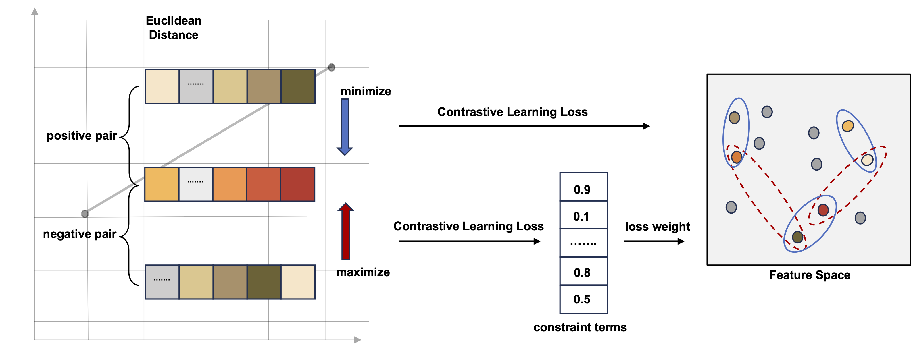

# CyclePermea: Membrane Permeability Prediction of Cyclic Peptides with a Multi-Loss Fusion Network

## Introduction
Cyclic peptides, known for their unique ring-like structures, show considerable promise in therapeutic applica- tions. Experimentally determining their permeability is time- consuming and labor-intensive. Hence, an efficient and rapid membrane permeability prediction model would greatly expedite the early-stage screening of cyclic peptide drugs. To meet this end, we proposed a novel deep learning model to predict membrane permeability of cyclic peptides, dubbed as CyclePermea. Re- markably, CyclePermea predicts membrane permeability using only the 1D sequence information of cyclic peptides, unlike previous works based on complex spatial descriptors and various physicochemical properties. It incorporates a peptide encoder based on a pre-trained BERT architecture. We also introduced two auxiliary loss functions designed to enhance the model’s comprehension of cyclic peptides’ distinctive characteristics. The first, termed ’Constraint Contrastive Learning Loss’, aims to mitigate the challenge of feature clustering. The second, ’Cyclization Site Prediction Loss’, is proposed to facilitate the model’s recognition of the unique spatial structure inherent in cyclic peptides. Through extensive experiments, CyclePermea demonstrated superior performance over baseline models in the benchmark dataset, both in in-distribution settings and simulated out-of-distribution settings. We hope that CyclePermea would contribute in accelerating the early screening of cyclic peptide drugs in the future.
### Model Architecture


### Constraint Contrastive Learning Loss


### DataSet
The basic dataset is from Cycpeptmpdb: A comprehensive database of membrane permeability of cyclic peptides (https://pubs.acs.org/doi/10.1021/acs.jcim.2c01573)
We have divided it in-distribution settings and simulated out-of-distribution settings. The distribution are as follows:


## Quickly start
### Main requirments
- Python 3.7
- rdkit 2020.09.1.0
- torch 1.11.0
- numpy
- pandas

### Config
You can use yaml files (./DL/config) to control the parameters as well as the network structure.

### Train
```python
python main.py
```

### Test
```python
python test.py
```


